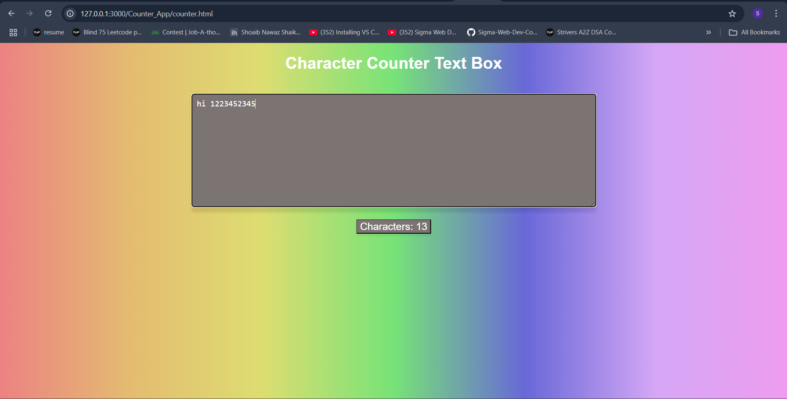

# Counter_App
## Date: 10-07-2025
## Objective:
To build a live character counter using JavaScript that dynamically displays the number of characters entered into a textarea — similar to what you see in Twitter or feedback forms.

## Tasks:

#### 1. Create the HTML Structure:
Add a ```<textarea>``` for user input.

Place a ```<div> or <p>``` below it to show the live character count.

Include a label or heading like “Write your message”.

#### 2. Style with CSS:
Center the layout using margin or flexbox.

Style the textarea with border, padding, and font size.

Style the counter to be bold and place it neatly below the input area.

#### 3. Add JavaScript Functionality:
Use addEventListener("input", ...) on the textarea.

Inside the function, get the length of the value (.value.length).

Update the counter element with this number in real time.

#### 4. Enhancements:
Set a maximum character limit (e.g., 100) and show remaining characters.

Change the text color if the user exceeds the limit.

Add emojis or icons using Unicode for visual feedback.
## HTML Code:
```html
<!DOCTYPE html>
<html lang="en">
<head>
    <meta charset="UTF-8">
    <meta name="viewport" content="width=device-width, initial-scale=1.0">
    <title>Character Counter</title>
    <link href="styles.css" rel="stylesheet" type="text/css">

</head>
<body class="color">
    <h1>Character Counter Text Box</h1>
    <textarea placeholder="Write your message" id="myTextarea"></textarea>
    <div class="spacing">
        
    <button>Characters: <span id="charCount">0</span></button>
    </div>
    <script src="scripts.js"></script>
</body>
</html>
```
## CSS Code:
```css
body{
    background-color: rgb(228, 118, 118);
    background-image: linear-gradient(to right, rgb(236, 130, 130), rgb(228, 188, 113), rgb(221, 221, 113), rgb(119, 227, 119), rgb(104, 104, 216), rgb(213, 167, 246), rgb(239, 156, 239));
    font-family: Arial, sans-serif;
    color: white;
    margin-left:auto;
    margin-right:auto;
    text-align: center;
}
textarea{
    
    width: 50%;
    height: 200px;
    padding: 10px;
    font-size: 16px;
    border-radius: 5px;
    border: 1px solid #ccc;
    box-shadow: 0 10px 5px rgba(0,0,0,0.1);
    margin-top: 20px;
    background-color: rgb(124, 115, 115);
    color: white

}
.spacing{
    margin-top: 20px;
}
::placeholder {
    color: white;
    font-family: Arial, sans-serif;
    font-size: 16px;
}
button{
    color: white;
    box-shadow: 0 3px 5px rgba(0,0,0,0.1);
    font-family: Arial, sans-serif;
    background-color: rgb(124, 115, 115);
    font-size: 125%;
    
}
```
## Javascript Code:
```javascript
document.addEventListener("DOMContentLoaded", function () {
  const textarea = document.getElementById("myTextarea");
  const counter = document.getElementById("charCount");

  textarea.addEventListener("input", function () {
    counter.textContent = textarea.value.length;
  });
});

```
## Output:


## Result:
A live character counter using JavaScript that dynamically displays the number of characters entered into a textarea — similar to what you see in Twitter or feedback forms is built successfully.
